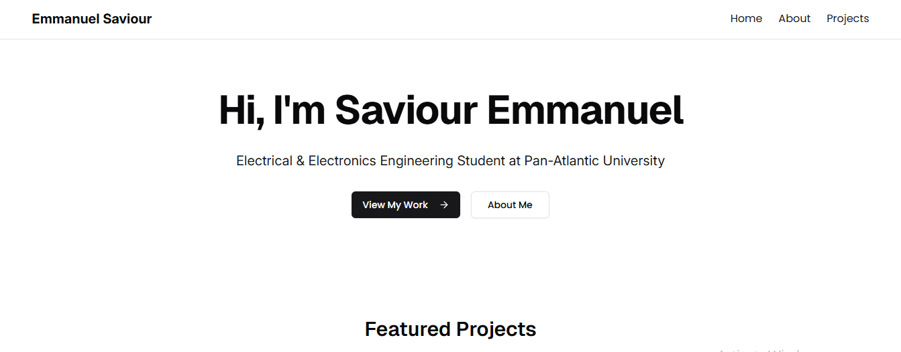

# Saviour Emmanuel | Hardware Engineering Portfolio

## Showcasing African embedded systems innovation

---



---

## 🚀 Overview

Digital portfolio for Saviour Emmauel, Hardware Engineering Lead at [Auptex](https://auptex.africa). Highlights indigenous hardware solutions for Africa's infrastructure challenges.

**Live Demo:** [saviour-emmanuel.netlify.app](https://saviour-emmanuel.netlify.app)

---

## 🔥 Key Features

- **Smart Energy Systems**: 92% efficiency inverters for off-grid communities  
- **Open Hardware**: CERN OHL-licensed circuit designs  
- **Ecosystem Building**: Mentorship at SST Makerspace  

---

## 🛠️ Tech Stack

| Component     | Technology               |
|--------------|---------------------------|
| Frontend     | React + Vite + Typescript |
| Styling      | Tailwind CSS              |
| Deployment   | Netlify                   |

---

## 📂 Repository Structure

```plaintext
Saviour-E-portfolio/
├── public/
├── src/
│ ├── components/
|   ├── ui/
| ├── assets/
│ ├── pages/
│ └── main.tsx
├── package.json
└── vite.config.js
```

---

## 🚀 Quick Start

```bash
git clone https://github.com/AJ-505/Saviour-E-portfolio.git
cd Saviour-E-portfolio
npm install
npm run dev
```

## 📜 License

MIT License

## 🌍 Connect with Saviour

- [LinkedIn](https://www.linkedin.com/in/emmanuel-saviour-a9812436b/?original_referer=https%3A%2F%2Fwww%2Egoogle%2Ecom%2F&originalSubdomain=ng)

- [Medium](https://medium.com/@emmanuelsaviour348)
